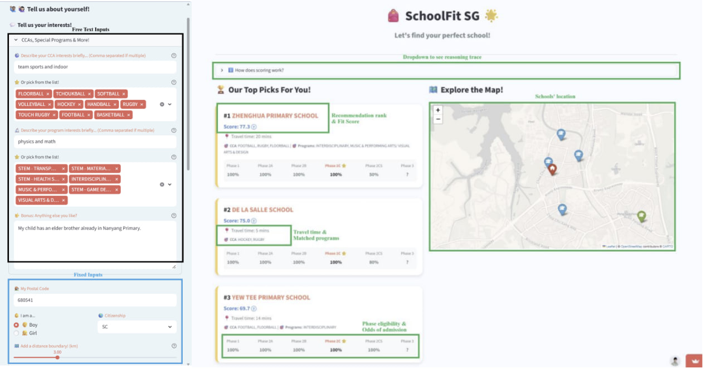

IRS-PM-2026-05-03-AIS08PT-GRP19-SchoolFit_SG.zip

---

## SECTION 1 : PROJECT TITLE
## SchoolFit SG - Intelligent Decision Support System for Singapore Primary School Selection

---

## SECTION 2 : EXECUTIVE SUMMARY / PAPER ABSTRACT
Each year, approximately 38,000 families navigate a high-stakes decision-making process, balancing school suitability (e.g., proximity, CCAs and programs) against admission feasibility within the competitive Primary 1 registration framework.  

While existing platforms provide useful data on school profiles, proximity, or historical admission trends, these tools generally address only fragments of the school selection process. None fully integrate personalized suitability assessment with admission feasibility analysis in a single decision support system. Consequently, parents are left to synthesize all this data from different sources manually, navigating through this stressful and complex decision landscape alone.  

Our project, SchoolFit SG, is an intelligent decision support system designed to integrate all these dimensions into a unified, data-driven recommendation system. The system is engineered around two core pillars of decision support: 
1. Suitability Modeling (Fit Score): Synthesizing complex school data to determine how suitable the school is for the child 
2. Admission Probability: Determining admission phase based on child’s profile and evaluating realistic success probabilities for that phase based on P1 rules and historical balloting data 

To achieve this, the system implements a multi-stage reasoning path utilizing course techniques: 
- Knowledge Base: A dual-track architecture integrating a relational database (school data) with a vector database (CCA and programs embeddings) for semantic search capabilities. 
- Semantic Matching: High-dimensional vector embeddings allow parents to use natural language to map generic preferences (e.g., "robotics and tech") to specific school programs and CCAs. 
- Decision Automation: A symbolic rule engine that evaluates phase eligibility 
- Cognitive Support: System outputs a transparent, ranked list of schools accompanied by scores, probabilities and reasoning traces, providing users with the "why" behind every recommendation.

By synthesizing symbolic rule-based logic, semantic vector search, and multi-criteria scoring, SchoolFit SG delivers context-aware, personalized recommendations alongside admission probability. This hybrid approach transcends the capabilities of conventional platforms by providing a transparent 'reasoning trace' for every result, empowering parents to make informed, data-driven decisions with the click of a button.

---

## SECTION 3 : CREDITS / PROJECT CONTRIBUTION

| Official Full Name  | Student ID (MTech Applicable)  | Role |
| :------------ |:---------------:| :-----|
| Tan Xian Liang | A0183638U | Project Leader |
| Chua Wentian Carine | A0340663H | Project Member |
| Zhou Lin (Jolin) | A0340258H | Project Member |
| Goh Hong Aik | A0096493N | Project Member |

---

## SECTION 4 : BUSINESS USE CASE & TECHNICAL VIDEOS

Refer to Project file

---

## SECTION 5 : USER GUIDE

### Requirements

- **Python 3.10+** (3.11 works well)
- [OpenAI](https://platform.openai.com/) API key
- [OneMap](https://www.onemap.gov.sg/) API portal account (email + password used to obtain routing/geocoding tokens)

### Quick start

From the **repository root** (`schoolfit/`):

```bash
python3 -m venv venv
source venv/bin/activate   # Windows: venv\Scripts\activate
pip install -r schoolfit_v2/requirements.txt
```

Secrets (never commit real keys):
secrets will be provided in zip file, secretes.toml (please don't share out)

```bash
cp .streamlit/secrets.toml.example .streamlit/secrets.toml
# Edit .streamlit/secrets.toml — set OPENAI_API_KEY, onemap_token_email, onemap_token_pwd
```

Run the app:

```bash
streamlit run schoolfit_v2/app.py
```

Then open the URL Streamlit prints (typically `http://localhost:8501`).


### Repo layout

| Path | Purpose |
|------|---------|
| `schoolfit_v2/app.py` | Streamlit UI |
| `schoolfit_v2/graph.py` | LangGraph pipeline (8 nodes) |
| `schoolfit_v2/data/` | School CSVs and `data/artifacts/` embedding files for semantic CCA/programme search |
| `schoolfit_v2/knowledge_base/` | Rule engine and MOE/policy-style rules |
| `.streamlit/secrets.toml` | Local secrets (gitignored); use `secrets.toml.example` as template |

---
## SECTION 6 : PROJECT REPORT / PAPER

Refer to Project file

---
